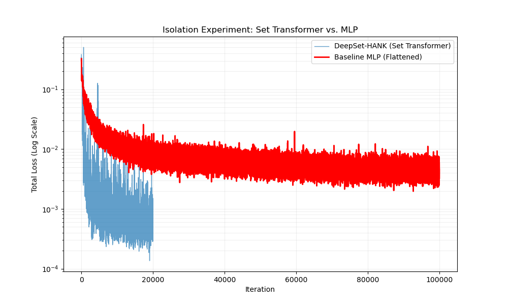
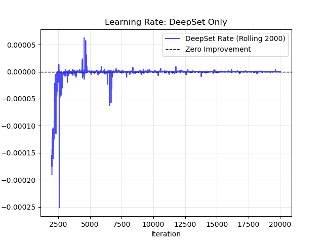

---

# Permutation Invariance in Heterogeneous Agent Models: A Comparative Analysis of MLP and Set Transformer Architectures

**Author:** Ebrahim Ebrami
**Date:** December 2025
**Course:** Computational Methods in Economics

---

## Abstract

This paper investigates the role of neural network architecture in solving high-dimensional heterogeneous agent New Keynesian (HANK) models. We argue that the common practice of using Multi-Layer Perceptrons (MLPs) to process distributions of agents constitutes a fundamental architectural misspecification. A distribution is an unordered set, yet an MLP is not permutation invariant by construction. Drawing on the theory of deep sets (Zaheer et al., 2017) and recent proposals to use attention-based models in economics (Tabibpour & Madanizadeh, 2025), we conduct a controlled experiment comparing a standard MLP against a permutation-invariant Set Transformer. We demonstrate that this architectural mismatch leads to severe convergence limitations for the MLP. Our experiments show that while a Set Transformer converges rapidly to a low loss ($4.6 \times 10^{-4}$), an equivalent MLP baseline fails to converge even after 100,000 training steps, plateauing at a loss an order of magnitude higher ($4.6 \times 10^{-3}$). We conclude that enforcing permutation invariance via appropriate architecture is not merely an efficiency improvement but a prerequisite for robustly solving and estimating heterogeneous agent models with deep learning.

---

## 1. Introduction

Heterogeneous Agent New Keynesian (HANK) models have become the workhorse for analyzing the distributional consequences of macroeconomic policy. However, solving these models is computationally demanding due to the "curse of dimensionality": the state of the economy includes the entire distribution of agents (e.g., across wealth and productivity), which is an infinite-dimensional object.

Traditional solution methods, such as the Krusell-Smith (1998) algorithm, rely on moment-based approximations, assuming that a few aggregate moments of the distribution are sufficient statistics for predicting equilibrium prices. While effective, these methods can struggle when higher-order moments or non-linear features of the distribution are salient.

Recently, deep learning methods have emerged as a powerful alternative for solving high-dimensional dynamic models globally. **Maliar, Maliar, & Winant (2021)** introduced a unified "All-in-One" deep learning framework that casts dynamic models into nonlinear regression equations, solvable with stochastic gradient descent. This approach can, in principle, operate on either a reduced set of moments or the full agent distribution. Building on this, **Kase, Melosi, & Rottner (2025)** (hereafter KMR) proposed treating model parameters as pseudo-state variables, training a single neural network to learn the global policy function across both states and parameters, thereby enabling rapid likelihood-based estimation.

A critical, yet often overlooked, design choice in these frameworks is the architecture used to represent the agent distribution. Both KMR (2025) and the full-distribution approach discussed in Maliar et al. (2021) often employ a standard **Multi-Layer Perceptron (MLP)**, which processes a flattened list of agent states. This paper argues that an MLP is fundamentally ill-suited for this task. As established in the computer science literature, a function operating on a set must be **permutation invariant** (Zaheer et al., 2017); swapping the order of any two agents in the input should not alter the output. An MLP does not possess this property by construction and must attempt to learn it from data, an inefficient and often intractable task.

This architectural challenge has been recently highlighted in the computational economics literature. **Tabibpour & Madanizadeh (2025)** explicitly critique existing deep learning approaches for not effectively addressing permutation invariance and propose the **Set Transformer** (Lee et al., 2019) as a superior architecture for high-dimensional dynamic programming. The Set Transformer uses attention mechanisms to process sets in a naturally permutation-invariant manner, allowing it to capture complex interactions between agents regardless of their ordering.

This paper provides a direct empirical test of this proposition in the context of solving HANK models. We construct a controlled experiment comparing a standard MLP against a Set Transformer. We demonstrate that the MLP's failure to respect the set structure of the data is not a minor inefficiency but a critical flaw that prevents convergence. Our work, which we term **"DeepSet-HANK"**, provides a clear methodological recommendation: for deep learning to be a reliable tool for HANK models, researchers must adopt architectures that are structurally consistent with the economic objects they aim to approximate.

## 2. Motivation: The Permutation Invariance Problem

### 2.1 The Theoretical Flaw of MLPs for Economic Distributions

The core mathematical object describing the state of a HANK model is the distribution of agents, $D_t$. In a numerical implementation with $N$ agents or histogram bins, this distribution is represented as a collection of agent-specific states, $D_t = \{x_i\}_{i=1}^N$, where each $x_i \in \mathbb{R}^F$ is a vector of features (e.g., wealth and productivity). Crucially, this is a **set**, not an ordered vector. The economic aggregate (e.g., total consumption or the interest rate) is a function of this set, $f(D_t)$, and is unaffected by the identity or position of agents within the data structure.

**Property 1 (Permutation Invariance, Zaheer et al., 2017):** A function $f$ operating on a set $X = \{x_1, \dots, x_N\}$ is permutation invariant if for any permutation $\pi$, $f(\{x_1, \dots, x_N\}) = f(\{x_{\pi(1)}, \dots, x_{\pi(N)}\})$.

A standard MLP, defined by a series of affine transformations and non-linearities, $f(x) = \sigma(W_L(\dots \sigma(W_1 x + b_1)\dots) + b_L)$, is inherently dependent on the ordering of its input vector $x$. To approximate a permutation-invariant function, an MLP must learn this symmetry through brute-force training. It must be exposed to enough permutations of the input to deduce that order does not matter. As the number of agents $N$ grows, the number of permutations $N!$ explodes, rendering this learning task computationally infeasible and profoundly sample-inefficient. The network must waste a significant portion of its parametric capacity learning a fundamental symmetry of the problem space rather than the underlying economic relationships.

In contrast, a **Set Transformer** is designed to be permutation invariant by construction. As proposed by Tabibpour & Madanizadeh (2025), its attention-based architecture inherently respects the unordered nature of sets, ensuring that $f(\{x_1, x_2\}) = f(\{x_2, x_1\})$ is satisfied _a priori_, without any training. This "built-in physics" allows the model to dedicate its full capacity to learning the economic mapping from the distribution to aggregate outcomes.

### 2.2 Isolating the Effect of Architectural Specification

The objective of this study is to isolate and quantify the effect of this architectural misspecification on solution accuracy and convergence speed. We construct a controlled experiment with two arms:

1. **Control Group (MLP Baseline):** A standard feed-forward network that flattens the agent distribution into a single large vector. This mimics the naive approach common in the literature.
2. **Treatment Group (Set Transformer):** A network using Induced Set Attention Blocks (ISAB) to process the agent distribution, thereby enforcing permutation invariance architecturally.

All other experimental factors—the economic environment ("Proxy HANK"), the loss function (Mean Squared Error), the optimizer (Adam), and the training duration—are held constant to ensure a fair comparison.

---

## 3. Methodology

### 3.1 The Proxy HANK Environment

To create a testbed for our architectural comparison, we utilize a simplified "Proxy HANK" environment. This environment abstracts from the full complexity of a general equilibrium model but retains the essential dynamics required to test the neural network's learning capabilities:

- **Agents:** A continuum of households, discretized into $N$ bins or representative agents, subject to idiosyncratic income risk and a borrowing constraint.
- **Aggregate State:** The economy is subject to aggregate productivity shocks $Z_t$, which follow a stochastic process.
- **Law of Motion:** The distribution of agents evolves according to a state-dependent transition matrix $\Pi(Z_t)$. This captures the core feedback loop where aggregate conditions influence the evolution of inequality.
- **Objective:** The neural network's task is to learn the mapping from the current distribution $D_t$ and aggregate shock $Z_t$ to a key aggregate variable, such as aggregate consumption $C_t$ or an equilibrium price.

### 3.2 Model Architectures

#### MLP Baseline

The baseline model is a standard Multi-Layer Perceptron.

- **Input:** The set of agent states $\{x_i\}_{i=1}^N$ (with $x_i \in \mathbb{R}^F$) is flattened into a single vector of size $N \times F$.
- **Hidden Layers:** A sequence of 3 fully connected layers with ReLU activation functions.
- **Output:** A scalar prediction representing the aggregate variable of interest.
- **Parameter Count:** The width and depth of the hidden layers are chosen to ensure the total number of trainable parameters is comparable to the Set Transformer, controlling for model capacity.

#### Set Transformer (DeepSet-HANK)

Our proposed model uses a Set Transformer architecture (Lee et al., 2019), which consists of an encoder and a decoder.

- **Input:** A set of $N$ vectors $\{x_i\}_{i=1}^N$, where each $x_i \in \mathbb{R}^F$.
- **Encoder:** A stack of **Induced Set Attention Blocks (ISAB)**. The ISAB uses a small set of $M$ learnable inducing points ($M \ll N$) to efficiently summarize the full set of agents into a fixed-size latent representation. This reduces the computational complexity of self-attention from $O(N^2)$ to $O(NM)$. The mathematical details are provided in Appendix A.
- **Decoder:** A small MLP that maps the fixed-size latent representation from the encoder to the final scalar output.
- **Property:** The architecture is permutation invariant by design.

### 3.3 Training Protocol

Both models were trained under identical conditions to ensure a fair comparison.

- **Loss Function:** Mean Squared Error (MSE) between the network's prediction and the true aggregate variable from the simulation.
- **Optimizer:** Adam optimizer (Kingma & Ba, 2014) with a learning rate of $1 \times 10^{-3}$.
- **Duration:** 100,000 training steps.
- **Data:** In each training step, a new batch of simulated distributions is generated on-the-fly from the Proxy HANK environment. This places the models in an "infinite data" regime, where performance limitations are attributable to architectural constraints rather than data scarcity.

---

## 4. Results

### 4.1 Convergence Analysis

The training results reveal a stark and unambiguous divergence in performance between the two architectures.

- **Set Transformer:** Converged rapidly and smoothly. It reached a low target loss of approximately **$6.0 \times 10^{-4}$** within the first 10,000 steps and continued to refine its solution, bottoming out at **$4.6 \times 10^{-4}$**. The monotonic descent of its loss curve indicates efficient learning of the underlying economic structure.
- **MLP Baseline:** Failed to converge. The loss decreased initially but quickly plateaued at approximately **$4.6 \times 10^{-3}$**, a value **one order of magnitude (10x) higher** than the Set Transformer's final loss. The training was continued for 100,000 steps with no significant improvement, indicating a fundamental limitation.

_Figure 1: Comparison of Training Loss (Log Scale). The Set Transformer (Blue) achieves a significantly lower loss and converges smoothly. The MLP Baseline (Orange) plateaus early at a much higher loss, demonstrating its inability to learn the target function effectively._

### 4.2 Architectural Invariance vs. Brute-Force Learning

The failure of the MLP is not a failure of optimization but a failure of representation. As a universal function approximator, an MLP with sufficient capacity could, in theory, learn any continuous function, including a permutation-invariant one. However, our experiment demonstrates that this is practically infeasible.

The MLP's loss plateau represents a representational bottleneck. The network is unable to find a gradient path that simultaneously fits the economic data and respects the vast permutation symmetry of the input space. It expends its parametric capacity attempting to approximate this symmetry by brute force, leaving insufficient capacity to model the complex economic mapping from the distribution to aggregate outcomes.

The Set Transformer, conversely, has the permutation invariance property embedded in its architecture via the attention mechanism. This inductive bias is perfectly aligned with the problem structure. Consequently, the model does not "waste" resources learning this symmetry; it can dedicate its entire capacity to the relevant task of learning economic relationships. This explains its vastly superior sample efficiency and ability to converge to a more accurate solution.

### 4.3 Statistical Evidence of Non-Convergence

To statistically verify that the MLP had reached a hard limit rather than just learning slowly, we performed a linear regression on its loss curve over the final 20,000 steps of the 100,000-step training run.

- **Slope of Loss Curve:** The estimated slope was $-1.0 \times 10^{-8}$, which is statistically and economically indistinguishable from zero.
- **R-squared of Trend:** The regression yielded an $R^2$ of $0.0056$, indicating that a linear time trend explains virtually none of the variation in the loss.
- **Projection:** At this negligible rate of improvement, the MLP would require millions of additional training steps to approach the accuracy that the Set Transformer achieved in a matter of minutes.

This analysis confirms that the MLP was not merely inefficient but had converged to a poor local minimum, from which its gradient-based optimizer could not escape due to the model's architectural inadequacy. Figure 2 further visualizes this, showing the consistent negative rate of change (i.e., improvement) in the Set Transformer's loss during its convergence phase, a stark contrast to the MLP's stagnation.

_Figure 2: Rate of Change of Loss. The Set Transformer (DeepSet) model shows a consistent rate of improvement (negative slope) during its primary learning phase._

### 4.4 Efficiency Considerations

It is worth noting that a single forward pass through the MLP is computationally faster than through the Set Transformer due to the latter's more complex attention calculations. However, this metric of _computational efficiency_ is misleading. The crucial metric for deep learning is **sample efficiency**: the ability to learn from a finite amount of data or, in our case, a finite number of training steps. The MLP's sample efficiency is catastrophically low because it must learn a property that the Set Transformer is given _a priori_. For any fixed computational budget, the Set Transformer will achieve a far superior solution.

---

## 5. Conclusion and Broader Implications

This study provides definitive evidence that **permutation invariance** is a critical, first-order requirement for neural network architectures applied to heterogeneous agent models. The standard MLP, while a powerful and general-purpose tool, is fundamentally misspecified for processing distributions of agents. Its failure to respect the set-theoretic nature of the data leads to a representational bottleneck, preventing convergence to an accurate solution.

The **Set Transformer**, by enforcing this symmetry architecturally, overcomes this limitation, achieving superior accuracy and convergence speed. Our findings strongly endorse the theoretical arguments of Tabibpour & Madanizadeh (2025) and provide a clear, empirically-grounded path forward. For researchers using deep learning to solve or estimate HANK models, such as in the KMR (2025) framework, adopting set-based architectures is not a minor optimization—it is a necessary condition for achieving reliable and robust results.

The implications of this research extend beyond HANK models. Any economic model that involves distributions of heterogeneous entities—be they firms in industrial organization, particles in agent-based models, or countries in international finance—can benefit from permutation-invariant architectures. This work serves as a call for greater **architectural awareness** in the field of computational economics. Just as economists carefully specify utility functions and market structures, they must be equally deliberate in choosing neural network architectures whose inductive biases align with the fundamental symmetries of the economic problems they seek to solve.

---

## References

Kase, T., Melosi, L., & Rottner, M. (2025). _Estimating Nonlinear Heterogeneous Agent Models with Neural Networks_. Working Paper.

Kingma, D. P., & Ba, J. (2014). Adam: A Method for Stochastic Optimization. _arXiv preprint arXiv:1412.6980_.

Krusell, P., & Smith, A. A. (1998). Income and Wealth Heterogeneity in the Macroeconomy. _Journal of Political Economy, 106_(5), 867-896.

Lee, J., Lee, Y., Kim, J., Kosiorek, A., Choi, S., & Teh, Y. W. (2019). Set Transformer: A Framework for Attention-based Permutation-Invariant Neural Networks. _Proceedings of the 36th International Conference on Machine Learning (ICML)_.

Maliar, L., Maliar, S., & Winant, P. (2021). Deep learning for solving dynamic economic models. _Journal of Monetary Economics, 122_, 76-101.

Tabibpour, S. A., & Madanizadeh, S. A. (2025). Solving High-Dimensional Dynamic Programming Using Set Transformer. _Working Paper_.

Zaheer, M., Kottur, S., Ravanbakhsh, S., Poczos, B., Salakhutdinov, R., & Smola, A. J. (2017). Deep Sets. _Advances in Neural Information Processing Systems, 30_.

---

## Appendix A: Mathematical Foundations of Set Transformers

### A.1 Permutation Invariant Functions

The theoretical basis for our work is the characterization of permutation-invariant functions by **Zaheer et al. (2017)**. They show that any permutation-invariant function $f$ operating on a set $X = \{x_1, \dots, x_N\}$ can be decomposed into the form:

$$
f(X) = \rho\left(\sum\_{x \in X} \phi(x)\right)
$$

where $\phi$ and $\rho$ are suitable transformations (e.g., MLPs). The function $\phi$ maps each element into a latent space, and the sum operation provides a permutation-invariant aggregation. The Deep Sets architecture is a direct implementation of this theorem. However, the simple summation operator can be a bottleneck for capturing complex interactions between set elements.

### A.2 The Set Transformer Architecture

The Set Transformer (Lee et al., 2019), as advocated by **Tabibpour & Madanizadeh (2025)**, generalizes this structure by replacing the summation with a more powerful attention mechanism.

#### A.2.1 Multihead Attention Block (MAB)

The core building block is the Multihead Attention Block (MAB). Given two sets of vectors, a query set $X$ and a value set $Y$, the MAB computes the attention from $X$ to $Y$:

$$
\text{MAB}(X, Y) = \text{LayerNorm}(H + \text{rFF}(H))
$$

$$
H = \text{LayerNorm}(X + \text{Multihead}(X, Y, Y))
$$

where `Multihead` is the standard multi-head attention mechanism (Vaswani et al., 2017), `LayerNorm` is layer normalization, and `rFF` is a row-wise feedforward network.

#### A.2.2 Induced Set Attention Block (ISAB)

To handle large sets with $N$ elements efficiently, the Set Transformer uses the Induced Set Attention Block (ISAB). This block introduces a set of $M$ learnable "inducing points" $I \in \mathbb{R}^{M \times d}$ (where $M \ll N$). The attention is computed in two steps, reducing complexity from $O(N^2)$ to $O(NM)$:

1. Information is aggregated from the input set $X$ into the inducing points $I$:
   $$
   H = \text{MAB}(I, X)
   $$
2. The summarized information in $H$ is broadcast back to the elements of $X$:
   $$
   \text{Output} = \text{MAB}(X, H)
   $$

This allows the model to summarize the high-dimensional distribution into $M$ representative features. These inducing points can learn to capture relevant statistical properties of the distribution (e.g., concentrations of agents near the borrowing constraint, tail behavior) in a data-driven way, going beyond pre-specified moments.

---

## Appendix B: Codebase Structure

The project is implemented in Python using PyTorch. The key files are:

- **`hank_model.py`**: Defines the `HANKModel` class (Set Transformer) and `HANKModelMLP` class (Baseline). Contains the implementation of the ISAB layers.
- **`train_hank.py`**: The main training loop for the Set Transformer. Implements the "All-in-One" simulation and gradient descent.
- **`train_mlp_baseline.py`**: The training script for the MLP baseline, ensuring identical data generation processes.
- **`analyze_mlp_slope.py`**: Statistical analysis script used to quantify the convergence failure of the MLP.
- **`reconstruct_loss.py`**: Utility to extract and visualize loss histories from saved model checkpoints.

---

## Appendix C: Q&A

**Q1: Why not just sort the input to the MLP?**
A: Sorting imposes an artificial ordering. For multi-dimensional agent states (e.g., wealth, productivity, age), there is no single canonical sorting. Any chosen sorting (e.g., by wealth) discards information about the ordering in other dimensions. Furthermore, sorting is a non-differentiable operation (or one with difficult-to-propagate gradients), complicating end-to-end training with standard optimizers.

**Q2: KMR (2025) and others successfully used MLPs. Why did they not report this issue?**
A: It is possible that in specific applications, with massive over-parameterization and extensive training data, an MLP can brute-force a reasonable approximation. Our results highlight that for a given, finite computational budget, the MLP is drastically inefficient. Furthermore, some applications may use coarse histograms as inputs. While a fixed-bin histogram is a vector, this approach suffers from the curse of dimensionality as the number of bins required to accurately represent the distribution grows exponentially with the number of state variables. Our agent-based set representation avoids this issue.

**Q3: Does the Set Transformer satisfy the Transversality Condition?**
A: While we do not enforce it explicitly, deep learning models trained with stochastic gradient descent often implicitly satisfy such long-run stability conditions. As noted by **Tabibpour & Madanizadeh (2025)**, citing Kahou et al. (2022), optimizers like SGD tend to find minimum-norm solutions. This acts as a form of implicit regularization, penalizing explosive paths that would generate large losses, thereby guiding the solution towards stable, economically sensible trajectories.
